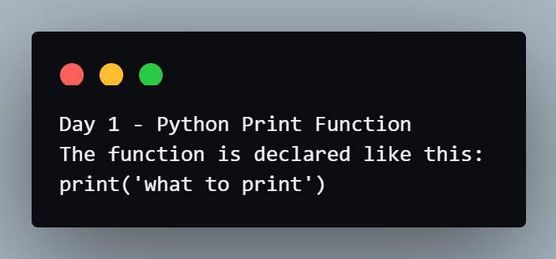
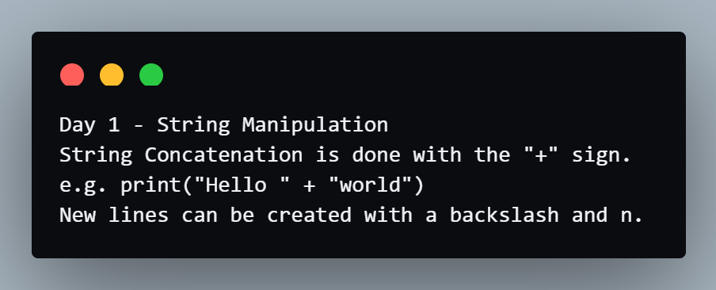
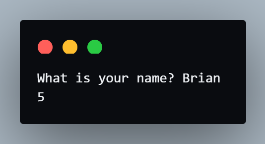
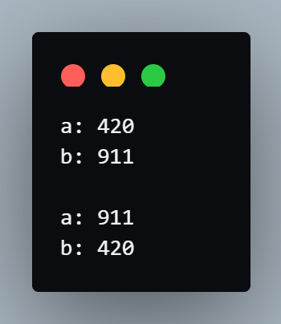
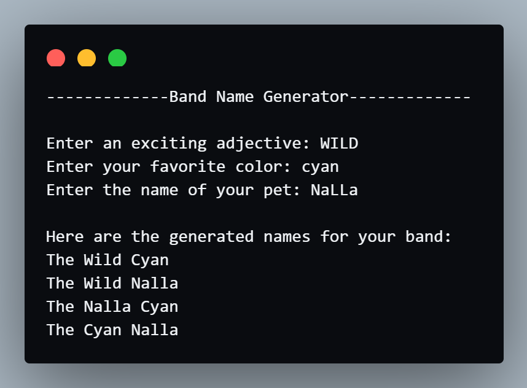

# Coding Exercises
#### Click the toggle button to show the contents of the code and output.

## Exercise 1 - Printing
- Instructions:<br>
Write a program that prints out the notes below.<br>
Day 1 - Python Print Function<br>
The function is declared like this:<br>
print('what to print')

<details>
<summary>Code:</summary>

```py
print("Day 1 - Python Print Function")
print("The function is declared like this:")
print("print('what to print')")
```
</details>

<details>
<summary>Output:</summary>


</details>

## Exercise 2 - Debugging Practice
- Instructions:<br>
Look at the code below. Fix the code so that it runs without errors.

- Code with error:
```py
print(Day 1 - String Manipulation)
print(String Concatenation is done with the "+" sign.)
print('e.g. print("Hello " + "world))
print(New lines can be created with a backslash and n.")
```

<details>
<summary>Code:</summary>

```py
print("Day 1 - String Manipulation")
print('String Concatenation is done with the "+" sign.')
print('e.g. print("Hello " + "world")')
print("New lines can be created with a backslash and n.")
```
</details>

<details>
<summary>Output:</summary>


</details>

## Exercise 3 - Input Function
- Instructions:<br>
Write a program that prints the number of characters in a user's name.

- Input:<br>
Angela

- Output:<br>
6

<details>
<summary>Code:</summary>

```py
name = input("What is your name? ")
print(len(name))
```
</details>

<details>
<summary>Output:</summary>


</details>

## Exercise 4 - Variable
- Instructions:<br>
Write a program that switches the values stored in the variables a and b.

- Input:<br>
a: 3<br>
b: 5

- Output:<br>
a: 5<br>
b: 3

<details>
<summary>Code:</summary>

```py
a = input("a: ")
b = input("b: ")

temp = a
a = b
b = temp

print(f"\na: {a}")
print(f"b: {b}")
```
</details>

<details>
<summary>Output:</summary>


</details>
<hr>

# Project: Band Name Generator
- Code:
```py
print("-------------Band Name Generator-------------\n")
adjective = input("Enter an exciting adjective: ").capitalize()
city = input("Enter your favorite color: ").capitalize()
pet = input("Enter the name of your pet: ").capitalize()

print("\nHere are the generated names for your band:")
print(f"The {adjective} {city}")
print(f"The {adjective} {pet}")
print(f"The {pet} {city}")
print(f"The {city} {pet}")
```

- Output:<br>
