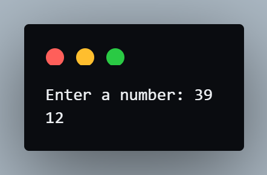
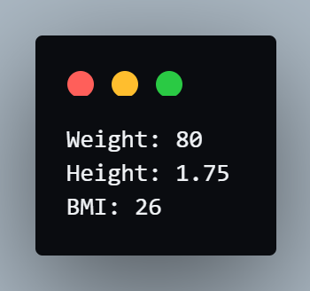
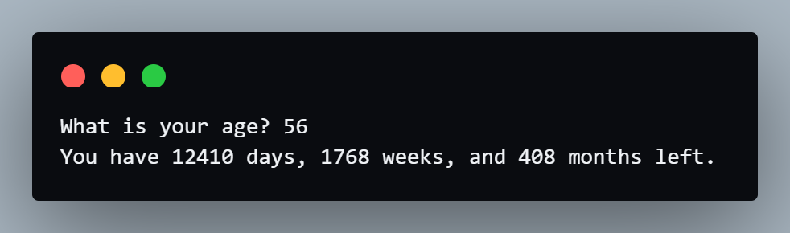
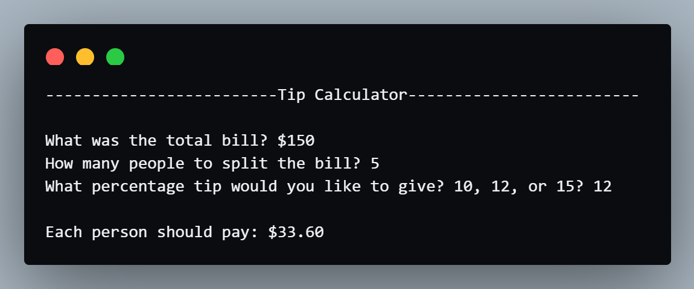

# Coding Exercises
## Exercise 1 - Data Types
- Instructions:<br>
Write a program that adds the digits in a 2 digit number. e.g. if the input was 35, then the output should be 3 + 5 = 8

- Input:<br>
39

- Output:<br>
12

- Code:
```py
num = input("Enter a number: ")
sum = int(num[0]) + int(num[1])
print(sum)
```

- Result:<br>


## Exercise 2 - BMI Calculator
- Instructions:<br>
Write a program that calculates the Body Mass Index (BMI) from a user's weight and height.

- Input:<br>
weight = 80<br>
height = 1.75

- Output:<br>
26

- Code:
```py
weight = int(input("Weight: "))
height = float(input("Height: "))
bmi = weight / (height * height) 
print(f"BMI: {round(bmi)}")
```

- Result:<br>


## Exercise 3 - Life in Weeks
- Instructions:<br>
Create a program using maths and f-Strings that tells us how many days, weeks, months we have left if we live until 90 years old.

- Input:<br>
56

- Output:<br>
You have 12410 days, 1768 weeks, and 408 months left.

- Code:
```py
age = int(input("What is your age? "))
age = 90 - age

day = 365 * age
week = 52 * age
month = 12 * age

print(f"You have {day} days, {week} weeks, and {month} months left.")
```

- Result:<br>


# Day 2 Project - Tip Calculator
- Instructions:<br>
Make a tip calculator

- Code:
```py
print("-------------------------Tip Calculator-------------------------")
bill = float(input("\nWhat was the total bill? $"))
people = int(input("How many people to split the bill? "))
tip = int(input("What percentage tip would you like to give? 10, 12, or 15? "))

payment = (bill / people) * (1 + (tip/100))

print(f"\nEach person should pay: ${payment:0.2f}")
```

- Output:<br>
