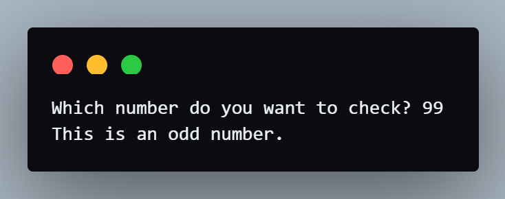
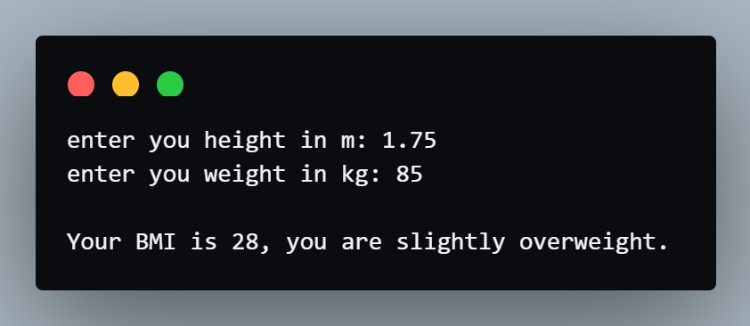
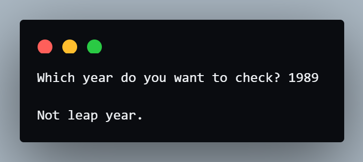
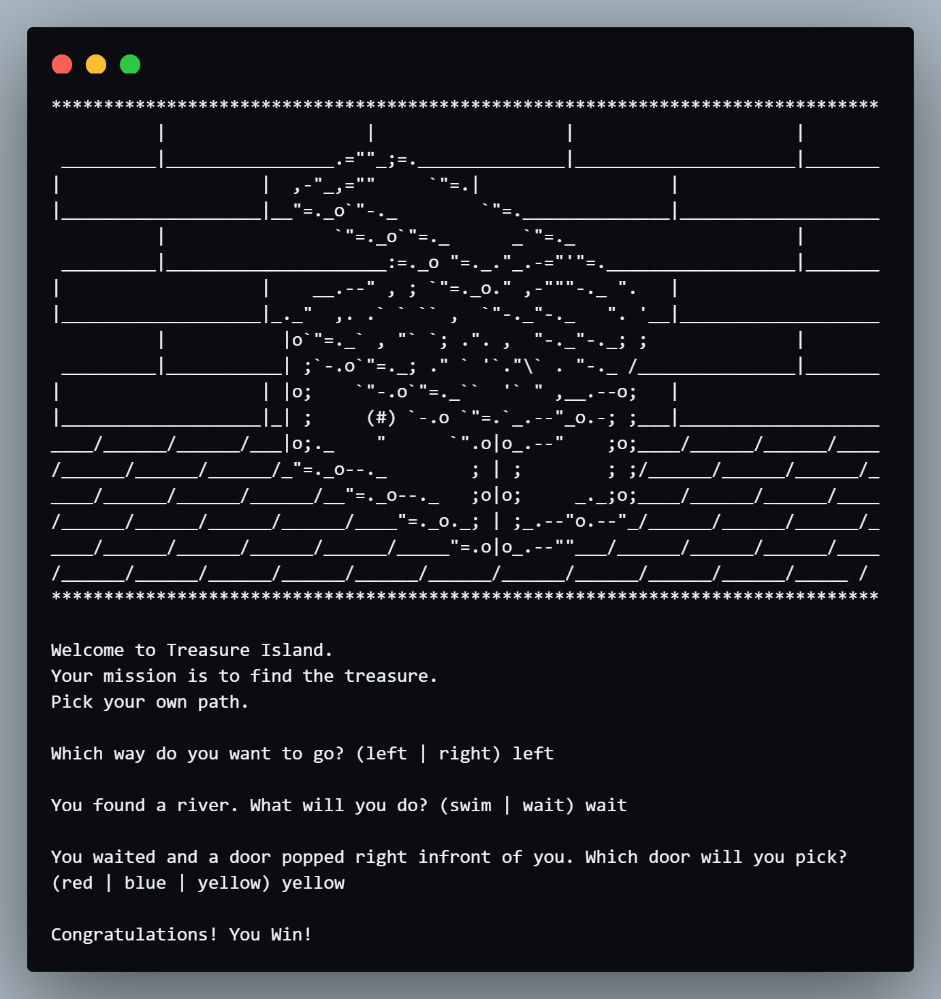

# Coding Exercises
## Exercise 1 - Odd or Even
- Instructions:<br>
Write a program that works out whether if a given number is an odd or even number.

- Input:<br>
43<br>
94

- Output:<br>
This is an odd number.<br>
This is an even number.

- Code:
```py
num = int(input("Which number do you want to check? "))
if num % 2 == 0:
    print("This is an even number.")
else:
    print("This is an odd number.")
```

- Result:<br>


## Exercise 2 - BMI 2.0
- Instructions:<br>
Write a program that interprets the Body Mass Index (BMI) based on a user's weight and height.

- Input:<br>
weight = 85<br>
height = 1.75   

- Output:<br>
Your BMI is 28, you are slightly overweight.

- Code:
```py
height = float(input("enter you height in m: "))
weight = float(input("enter you weight in kg: "))

bmi = round(weight / height ** 2)
if bmi < 18.5:
    print(f"\nYour BMI is {bmi}, you are underweight.")
elif bmi < 25:
    print(f"\nYour BMI is {bmi}, you have a normal weight.")
elif bmi < 30:
    print(f"\nYour BMI is {bmi}, you are slightly overweight.")
elif bmi < 35:
    print(f"\nYour BMI is {bmi}, you are obese.")
else:
    print(f"\nYour BMI is {bmi}, you are clinically obese.")
```

- Result:<br>


## Exercise 3 - Leap Year
- Instructions:<br>
Write a program that works out whether if a given year is a leap year. A normal year has 365 days, leap years have 366, with an extra day in February.

- Input:<br>
2400<br>
1989

- Output:<br>
Leap year.<br>
Not leap year.

- Code:
```py
year = int(input("Which year do you want to check? "))
if (year % 4 == 0 and year % 100 != 0) or year % 400 == 0:
    print("\nLeap year.")
else:
    print("\nNot leap year.")
```

- Result:<br>


## Exercise 4 - Pizza Order Practice
- Instructions:<br>
Congratulations, you've got a job at Python Pizza. Your first job is to build an automatic pizza order program.<br>
Small Pizza: $15<br>
Medium Pizza: $20<br>
Large Pizza: $25<br>
Pepperoni for Small Pizza: +$2<br>
Pepperoni for Medium or Large Pizza: +$3<br>
Extra cheese for any size pizza: + $1

- Input:<br>
Size: L<br>
Pepperoni: Y<br>
Cheese: N

- Output:<br>
Your final bill is $28.

- Code:
```py
print("Welcome to Python Pizza Deliveries!\n")
size = input("What size of pizza do you want? (S, M, or L) ")
add_pepperoni = input("Do you want pepperoni? (Y or N) ")
extra_cheese = input("Do you want extra cheese? (Y or N) ")

prize = 0
if size == 'S':
    prize += 15
    if add_pepperoni == 'Y':
        prize += 2
if size == 'M':
    prize += 20
    if add_pepperoni == 'Y':
        prize += 3
if size == 'L':
    prize += 25
    if add_pepperoni == 'Y':
        prize += 3
if extra_cheese == 'Y':
    prize += 1

print(f"\nYour final bill is: ${prize}.")
```

- Result:<br>


## Exercise 5 - Love Calculator
- Instructions:<br>
You are going to write a program that tests the compatibility between two people.<br><br>
To work out the love score between two people:<br>
Take both people's names and check for the number of times the letters in the word TRUE occurs. <br>
Then check for the number of times the letters in the word LOVE occurs. <br>
Then combine these numbers to make a 2 digit number.

For Love Scores less than 10 or greater than 90, the message should be:
"Your score is **x**, you go together like coke and mentos."

For Love Scores between 40 and 50, the message should be:
"Your score is **y**, you are alright together."

Otherwise, the message will just be their score. e.g.:
"Your score is **z**."

- Input:<br>
name1 = "Kanye West"<br>
name2 = "Kim Kardashian"

- Output:<br>
Your score is 42, you are alright together.

- Code:
```py
print("Welcome to the Love Calculator!\n")
name1 = input("What is your name? \n")
name2 = input("What is their name? \n")

name1 = name1.lower()
name2 = name2.lower()
couple = name1 + name2

# true count
count1 = 0
count1 += couple.count('t')
count1 += couple.count('r')
count1 += couple.count('u')
count1 += couple.count('e')
count1 *= 10

# love count
count2 = 0
count2 += couple.count('l')
count2 += couple.count('o')
count2 += couple.count('v')
count2 += couple.count('e')

count = count1 + count2

if count < 10 or count > 90:
    print(f"\nYour score is {count}, you go together like coke and mentos.")
elif count > 40 and count < 50:
    print(f"\nYour score is {count}, you are alright together.")
else:
    print(f"\nYour score is {count}.")
```
- Result:<br>


# Day 3 Project - Treasure Island
- Instructions:<br>
https://app.diagrams.net/?lightbox=1&highlight=0000ff&edit=_blank&layers=1&nav=1&title=Treasure%20Island%20Conditional.drawio#Uhttps%3A%2F%2Fdrive.google.com%2Fuc%3Fid%3D1oDe4ehjWZipYRsVfeAx2HyB7LCQ8_Fvi%26export%3Ddownload

- Code:
```py
print('''
*******************************************************************************
          |                   |                  |                     |
 _________|________________.=""_;=.______________|_____________________|_______
|                   |  ,-"_,=""     `"=.|                  |
|___________________|__"=._o`"-._        `"=.______________|___________________
          |                `"=._o`"=._      _`"=._                     |
 _________|_____________________:=._o "=._."_.-="'"=.__________________|_______
|                   |    __.--" , ; `"=._o." ,-"""-._ ".   |
|___________________|_._"  ,. .` ` `` ,  `"-._"-._   ". '__|___________________
          |           |o`"=._` , "` `; .". ,  "-._"-._; ;              |
 _________|___________| ;`-.o`"=._; ." ` '`."\` . "-._ /_______________|_______
|                   | |o;    `"-.o`"=._``  '` " ,__.--o;   |
|___________________|_| ;     (#) `-.o `"=.`_.--"_o.-; ;___|___________________
____/______/______/___|o;._    "      `".o|o_.--"    ;o;____/______/______/____
/______/______/______/_"=._o--._        ; | ;        ; ;/______/______/______/_
____/______/______/______/__"=._o--._   ;o|o;     _._;o;____/______/______/____
/______/______/______/______/____"=._o._; | ;_.--"o.--"_/______/______/______/_
____/______/______/______/______/_____"=.o|o_.--""___/______/______/______/____
/______/______/______/______/______/______/______/______/______/______/_____ /
*******************************************************************************
''')
print("Welcome to Treasure Island.")
print("Your mission is to find the treasure.") 
print("Pick your own path.")

direction = input("\nWhich way do you want to go? (left | right) ")
if direction == 'left':
    print()
else:
    print("You fell into a hole.\nGame Over.")
    exit()

if_swim = input("You found a river. What will you do? (swim | wait) ")
if if_swim == "wait":
    print()
else:
    print("You got attacked by a trout.\nGame Over.")
    exit()

door = input("You waited and a door popped right infront of you. Which door will you pick? (red | blue | yellow) ")
if door == "red":
    print("\nYou got burned by fire.\nGame Over.")
elif door == "blue":
    print("\nYou got eaten by beasts.\nGame Over.")
elif door == "yellow":
    print("\nCongratulations! You Win!")
else:
    print("\nGame Over.")
```

- Output:<br>
