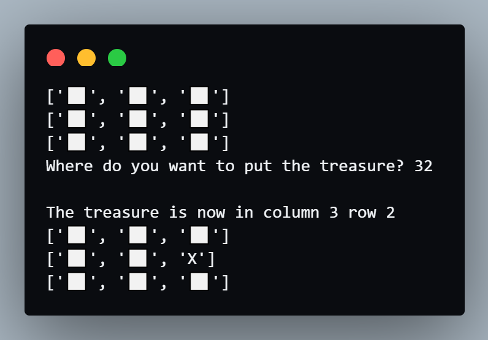
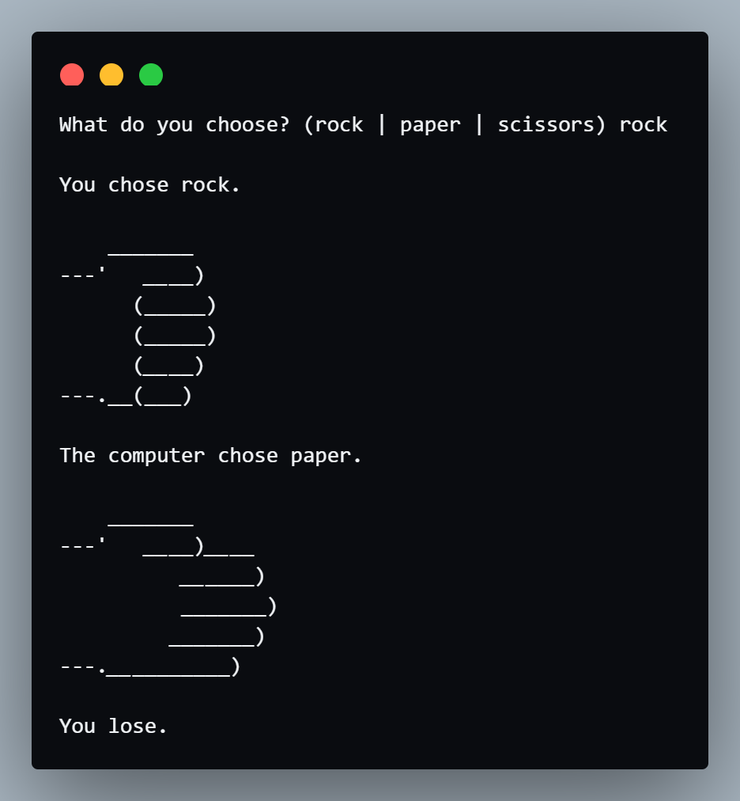

# Coding Exercises

## Exercise 1 - Heads or Tails
- Instructions:<br>
You are going to write a virtual coin toss program. It will randomly tell the user "Heads" or "Tails".

- Output:<br>
Heads<br>
Tails

- Code:
```py
import random

if random.randint(0, 1) == 1:
    print("Heads")
else:
    print("Tails")
```

- Result:<br>


## Exercise 2 - Banker Roulette
- Instructions:<br>
You are going to write a program that will select a random name from a list of names. The person selected will have to pay for everybody's food bill.<br>
Important: You are not allowed to use the choice() function.

- Input:<br>
Angela, Ben, Jenny, Michael, Chloe

- Output:<br>
Michael is going to buy the meal today!

- Code:
```py
import random

names_string = input("Give me everybody's names, separated by a comma. ")
names = names_string.split(", ")

index = random.randint(0, len(names) - 1)
print(f"{names[index]} is going to buy the meal today!")
```
- Result:<br>


## Exercise 3 - Treasure Map
- Instructions:<br>
You are going to write a program that will mark a spot with an X.<br>
23 = 2nd column and 3rd row

- Input:<br>
23

- Output:<br>
['⬜️', '⬜️', '⬜️']<br>
['⬜️', '⬜️', '⬜️']<br>
['⬜️', 'X', '⬜️']

- Code:
```py
row1 = ["⬜️","️⬜️","️⬜️"]
row2 = ["⬜️","⬜️","️⬜️"]
row3 = ["⬜️️","⬜️️","⬜️️"]
map = [row1, row2, row3]
print(f"{row1}\n{row2}\n{row3}")
position = str(input("Where do you want to put the treasure? "))

treasure = map[int(position[1]) - 1][int(position[0]) - 1] = 'X'

print(f"\nThe treasure is now in column {position[0]} row {position[1]}")
print(f"{row1}\n{row2}\n{row3}")
```

- Result:<br>


# Project - Rock Paper Scissors
- Instructions:<br>
Create a rock papers scissors game

- Code:
```py
import random
rock = '''
    _______
---'   ____)
      (_____)
      (_____)
      (____)
---.__(___)
'''

paper = '''
    _______
---'   ____)____
          ______)
          _______)
         _______)
---.__________)
'''

scissors = '''
    _______
---'   ____)____
          ______)
       __________)
      (____)
---.__(___)
'''
ans = input("What do you choose? (rock | paper | scissors) ")
print(f"\nYou chose {ans}.")
if ans == "rock":
    print(rock)
elif ans == "paper":
    print(paper)
elif ans == "scissors":
    print(scissors)
else:
    exit()

choices = ["rock", "paper", "scissors"]
chosen = random.choice(choices)

win = 0
draw = 0
print(f"The computer chose {chosen}.")
if chosen == "rock":
    print(rock)
    if ans == "paper":
        win = 1
    elif ans == "rock":
        draw = 1
    else:
        win = 0
elif chosen == "paper":
    print(paper)
    if ans == "scissors":
        win = 1
    elif ans == "paper":
        draw = 1
    else:
        win = 0
elif chosen == "scissors":
    print(scissors)
    if ans == "rock":
        win = 1
    elif ans == "scissors":
        draw = 1
    else:
        win = 0

if win == 1:
    print("You win.")
elif draw == 1:
    print("It's a draw")
else:
    print("You lose.")
```

- Output:<br>
