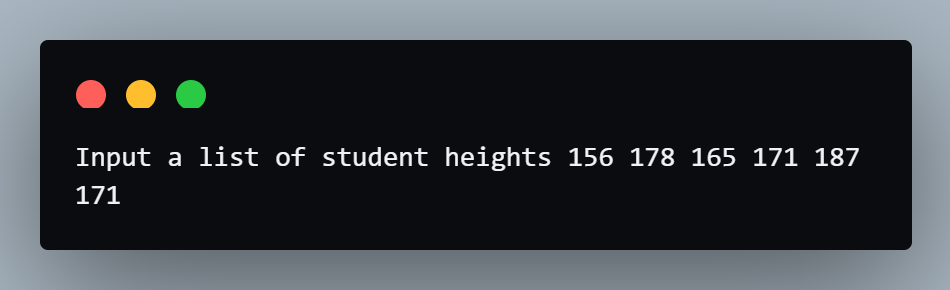

# Coding Exerices

## Exercise 1 - Average Height
- Instructions:<br>
You are going to write a program that calculates the average student height from a List of heights.<br>
Important: You should not use the sum() or len() functions in your answer.

- Input:<br>
156 178 165 171 187

- Output:<br>
171

- Code:
```py
student_heights = input("Input a list of student heights ").split()
for n in range(0, len(student_heights)):
    student_heights[n] = int(student_heights[n])

sum = 0
length = 0
for height in student_heights:
    length += 1
    sum += height

average = sum / length
print(round(average))
```

- Result:<br>


## Exercise 2 - High Score
- Instructions:<br>
You are going to write a program that calculates the highest score from a list of scores.<br>
Important: You are not allowed to use the max() or min() functions.

- Input:<br>
78 65 89 86 55 91 64 89

- Output:<br>
The highest score in the class is: 91

- Code:
```py
student_scores = input("Input a list of student scores ").split()
for n in range(0, len(student_scores)):
  student_scores[n] = int(student_scores[n])
print(student_scores)

highest_score = student_scores[0]
for score in student_scores:
    if score > highest_score:
       highest_score = score

print(f"The highest score in the class is: {highest_score}")
```

- Result:<br>


## Exercise 3 - Adding Even Numbers
- Instructions:<br>
You are going to write a program that calculates the sum of all the even numbers from 1 to 100.<br>
Thus, the first even number would be 2 and the last one is 100

- Output:<br>
2550

- Code:
```py
sum = 0
for i in range(2, 102, 2):
    sum += i
print(sum)
```

- Result:<br>


# Exercise 4 - FizzBuzz
- Instructions:<br>
You are going to write a program that automatically prints the solution to the FizzBuzz game.<br>
Your program should print each number from 1 to 100 in turn.<br>
When the number is divisible by 3 then instead of printing the number it should print "Fizz".<br>
When the number is divisible by 5, then instead of printing the number it should print "Buzz".<br>
And if the number is divisible by both 3 and 5 e.g. 15 then instead of the number it should print "FizzBuzz"

- Output:<br>
1<br>
2<br>
Fizz<br>
4<br>
Buzz<br>
Fizz<br>
7<br>
8<br>
Fizz<br>
Buzz<br>
11<br>
Fizz<br>
13<br>
14<br>
FizzBuzz

- Code:
```py
for i in range(1, 101):
    if i % 5 == 0 and i % 3 == 0:
        print("FizzBuzz")
    elif i % 3 == 0:
        print("Fizz")
    elif i % 5 == 0:
        print("Buzz")
    else:
        print(i)
```

- Result:<br>


# Project - Password Generator
- Code Version 1:
```py
import random
import string

print("----------------Password Generator----------------\n")
letter_count = int(input("How many letters would you like in your password?\n"))
num_count = int(input("How many numbers would you like?\n"))
symbol_count = int(input("How many symbols would you like?\n"))

password = []
letter = list(string.ascii_letters)
for i in range(letter_count):
    index = random.randint(0, len(letter) - 1)
    password.append(letter[index])

num = list(string.digits)
for i in range(num_count):
    index = random.randint(0, len(num) - 1)
    password.append(num[index])

symbol = list(string.punctuation)
for i in range(symbol_count):
    index = random.randint(0, len(symbol) - 1)
    password.append(symbol[index])

random.shuffle(password)
password = ''.join(str(item) for item in password)
print(f"\nYour password is: {password}")
```

- Output:<br>


- Code Version 2:
```py
import random
import string

print("----------------Password Generator----------------\n")
letter_count = int(input("How many letters would you like in your password?\n"))
num_count = int(input("How many numbers would you like?\n"))
symbol_count = int(input("How many symbols would you like?\n"))

password = []
letter = list(string.ascii_letters)
for i in range(letter_count):
    password.append(random.choice(letter))

num = list(string.digits)
for i in range(num_count):
    password.append(random.choice(num))

symbol = list(string.punctuation)
for i in range(symbol_count):
    password.append(random.choice(symbol))

random.shuffle(password)
password = ''.join(str(item) for item in password)
print(f"\nYour password is: {password}")
```

- Output:<br>
