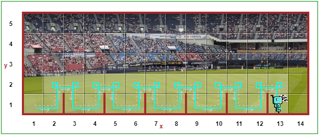
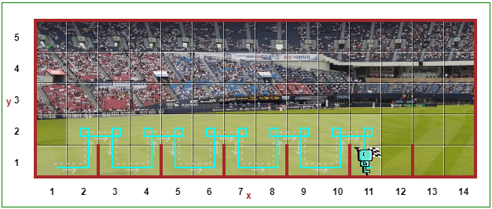
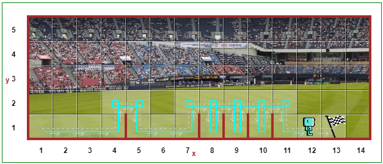
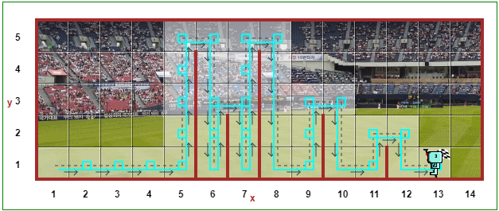
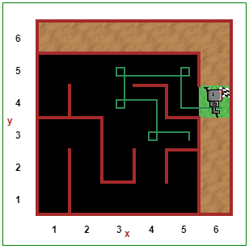

# Coding Exercises

## Hurdle 1

- Instructions:<br>
  https://reeborg.ca/reeborg.html?lang=en&mode=python&menu=worlds%2Fmenus%2Freeborg_intro_en.json&name=Hurdle%201&url=worlds%2Ftutorial_en%2Fhurdle1.json

- Code:

```py
def turn_right():
    turn_left()
    turn_left()
    turn_left()

def jump():
    turn_left()
    move()
    turn_right()
    move()
    turn_right()
    move()
    turn_left()

for i in range(0, 6):
    move()
    jump()
```

- Result:<br>
  

## Hurdle 2

- Instructions:<br>
  https://reeborg.ca/reeborg.html?lang=en&mode=python&menu=worlds%2Fmenus%2Freeborg_intro_en.json&name=Hurdle%202&url=worlds%2Ftutorial_en%2Fhurdle2.json

- Code:

```py
def turn_right():
    turn_left()
    turn_left()
    turn_left()

def jump():
    turn_left()
    move()
    turn_right()
    move()
    turn_right()
    move()
    turn_left()

while not at_goal():
    move()
    jump()
```

- Result:<br>
  

## Hurdle 3

- Instructions:<br>
  https://reeborg.ca/reeborg.html?lang=en&mode=python&menu=worlds%2Fmenus%2Freeborg_intro_en.json&name=Hurdle%203&url=worlds%2Ftutorial_en%2Fhurdle3.json

- Code:

```py
def turn_right():
    turn_left()
    turn_left()
    turn_left()

def jump():
    turn_left()
    move()
    turn_right()
    move()
    turn_right()
    move()
    turn_left()

while not at_goal():
    if front_is_clear():
        move()
    else:
        jump()
```

- Result:<br>
  

## Hurdle 4

- Instructions:<br>
  https://reeborg.ca/reeborg.html?lang=en&mode=python&menu=worlds%2Fmenus%2Freeborg_intro_en.json&name=Hurdle%204&url=worlds%2Ftutorial_en%2Fhurdle4.json

- Code Version 1:

```py
def turn_right():
    turn_left()
    turn_left()
    turn_left()

while not at_goal():
    while wall_in_front():
        turn_left()
        move()
        turn_right()
    move()
    turn_right()
    while not wall_in_front():
        move()
    turn_left()
```

- Code Version 2 (Video version):

```py
def turn_right():
    turn_left()
    turn_left()
    turn_left()

def jump():
    turn_left()
    while wall_on_right():
        move()
    turn_right()
    move()
    turn_right()
    while front_is_clear():
        move()
    turn_left()

while not at_goal():
    if wall_in_front():
        jump()
    else:
        move()
```

- Result:<br>
  

# Project - Reeborg World Maze

- Instructions:<br>
  https://reeborg.ca/reeborg.html?lang=en&mode=python&menu=worlds%2Fmenus%2Freeborg_intro_en.json&name=Maze&url=worlds%2Ftutorial_en%2Fmaze1.json

- Code:

```py
def turn_right():
    turn_left()
    turn_left()
    turn_left()

counter = 0
while not at_goal():
    if right_is_clear():
        turn_right()
        move()
        counter+=1
        if counter == 4:
            turn_left()
    elif front_is_clear():
        move()
    else:
        turn_left()
```

- Output:<br>
  
