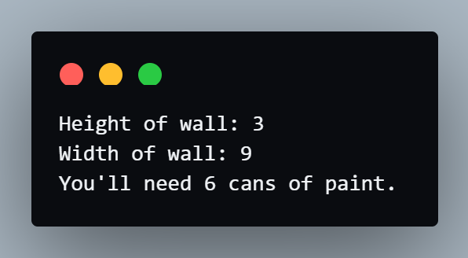
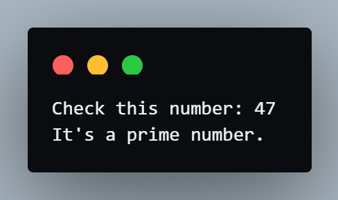
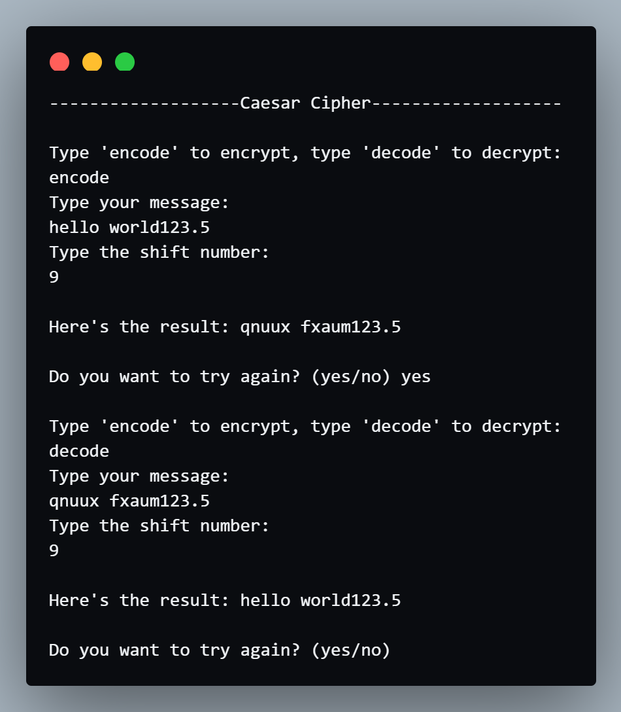

# Coding Exercises

## Exercise 1 - Paint Area Calculator
- Instructions:<br>
The instructions on the paint can says that 1 can of paint can cover 5 square meters of wall. Given a random height and width of wall, calculate how many cans of paint you'll need to buy.<br>
number of cans = (wall height x wall width) ÷ coverage per can.

- Input:<br>
height = 3<br>
width = 9

- Output:<br>
You'll need 6 cans of paint.

- Code:
```py
import math

def paint_calc(height, width, cover):
    cans = (height * width) / cover
    print(f"You'll need {math.ceil(cans)} cans of paint.")

test_h = int(input("Height of wall: "))
test_w = int(input("Width of wall: "))
coverage = 5
paint_calc(test_h, test_w, coverage)
```

- Result:<br>


## Exercise 2 - Prime Numbers
- Instructions:<br>
You need to write a function that checks whether if the number passed into it is a prime number or not.<br>
Prime numbers are numbers that can only be cleanly divided by themselves and 1.

- Input:<br>
73

- Output:<br>
It's a prime number.

- Code:
```py
def prime_checker(number):
    is_prime = 1
    if number == 0 or number == 1:
        is_prime = 0

    for i in range(2, number):
        if number % i == 0:
            is_prime = 0
            break

    if is_prime == 1:
        print("It's a prime number.")
    elif is_prime == 0:
        print("It's not a prime number.")

n = int(input("Check this number: "))
prime_checker(n)
```

- Result:<br>


# Project - Caesar Cipher
- Code: 
```py
import string 
characters = list(string.ascii_lowercase)
while 1:
    choice = input("Type 'encode' to encrypt, type 'decode' to decrypt:\n")
    message = input("Type your message:\n")
    shift = int(input("Type the shift number:\n"))

    # get the index of all the letters on the message based on the alphabet and add the shift number
    result = ''
    for char in message:
        if char in characters:
            index = characters.index(char)
            if choice == "encode":
                index = (index + shift) % 26
            if choice == "decode":
                index = (index - shift) % 26
            result += characters[index]
        else:
            result += char

    print(f"Here's the result: {result}")

    user_choice = input("Do you want to try again? (yes/no) ")
    if user_choice == "yes":
        continue
    else:
        break
```

- Output:<br>
